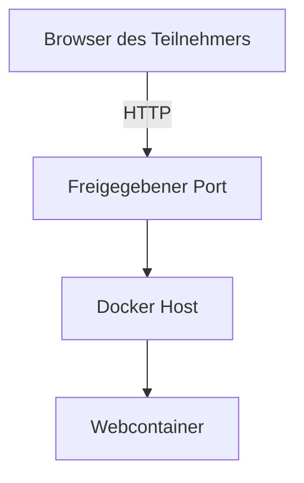
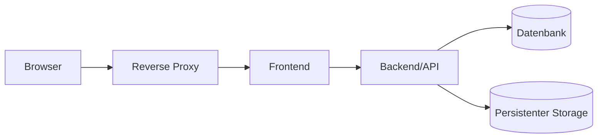
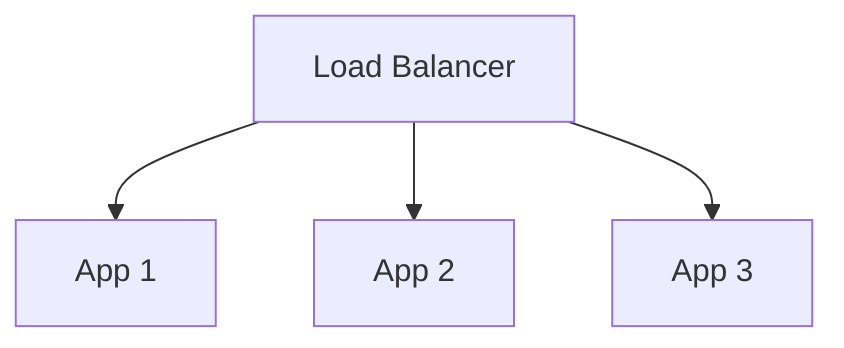
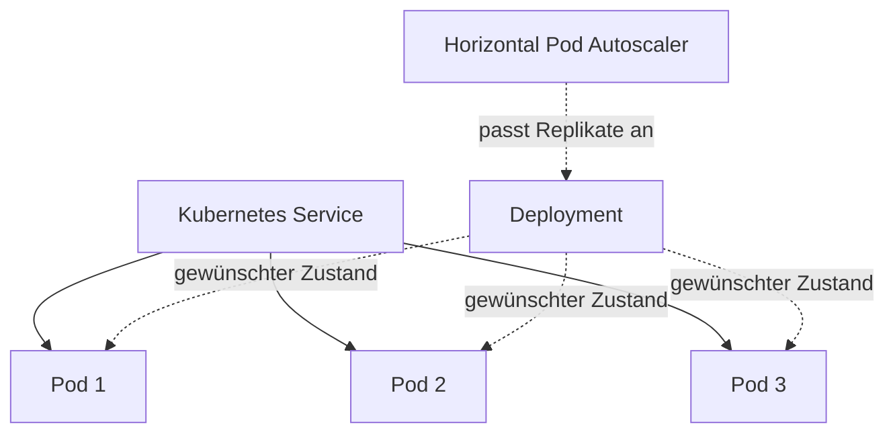
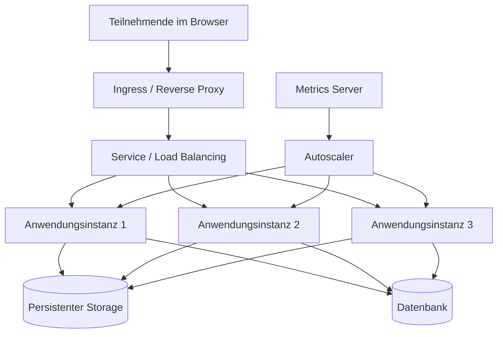
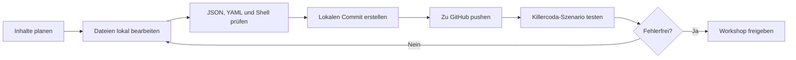

<div align="center">

# ☁️ Cloud Workshops mit Killercoda

**Praxisnahe Lernumgebungen zu Linux, Docker, Portainer, Netzwerken, Storage, Load Balancing und Kubernetes**

[](#workshop-roadmap)
[](https://killercoda.com/)
[](https://www.docker.com/)
[](https://kubernetes.io/)
[](#)
[](LICENSE)

</div>

---

## Über dieses Repository

Dieses Repository enthält eine zusammenhängende Reihe browserbasierter Cloud-Workshops. Die Teilnehmenden arbeiten in temporären Linux-, Docker- und Kubernetes-Umgebungen und stellen dort schrittweise eine Webanwendung bereit.

Im Mittelpunkt steht nicht das bloße Kopieren von Befehlen. Die Workshops sollen sichtbar machen, **welche Komponenten eine Cloud-Anwendung benötigt, wie diese Komponenten zusammenarbeiten und weshalb moderne Plattformen Container-Orchestrierung, Load Balancing, persistente Speicherung und automatische Skalierung einsetzen.**

Die Workshop-Reihe beginnt bewusst bei einem einzelnen Linux-Server und führt anschließend über Docker und Portainer bis zu Kubernetes.

> **Didaktisches Prinzip:** Jeder Workshop ist ein eigenständiges Szenario mit einem definierten Startzustand. Ein Folgeszenario kann automatisch mit der Musterlösung des vorherigen Workshops starten. Dadurch können die Teilnehmenden ohne Zeitverlust am nächsten Thema weiterarbeiten.

---

## Inhaltsverzeichnis

- [Lernziele](#lernziele)
- [Didaktisches Konzept](#didaktisches-konzept)
- [Workshop-Roadmap](#workshop-roadmap)
- [Technische Lernreise](#technische-lernreise)
- [Geplante Zielarchitektur](#geplante-zielarchitektur)
- [Repository-Struktur](#repository-struktur)
- [Aufbau eines Szenarios](#aufbau-eines-szenarios)
- [Lokale Bearbeitung](#lokale-bearbeitung)
- [Qualitätssicherung](#qualitätssicherung)
- [Sicherheit und Datenschutz](#sicherheit-und-datenschutz)
- [Versionierung](#versionierung)
- [Beitrag zum Projekt](#beitrag-zum-projekt)
- [Lizenz](#lizenz)

---

## Lernziele

Nach Abschluss der Workshop-Reihe sollen die Teilnehmenden:

- die Aufgaben eines virtuellen Linux-Servers in einer Cloud-Umgebung einordnen können,
- Betriebssystem, Container-Runtime, Container-Image und laufenden Container unterscheiden können,
- eine Webanwendung mit Docker bereitstellen können,
- Portfreigaben und grundlegende Netzwerkpfade nachvollziehen können,
- Anwendungen mit Portainer verwalten können,
- mehrere zusammengehörige Services als Stack beschreiben können,
- Docker-Netzwerke zur Trennung von Frontend, Backend und Datenbank einsetzen können,
- persistente Daten von kurzlebigen Container-Dateisystemen unterscheiden können,
- einen Reverse Proxy beziehungsweise Load Balancer vor mehreren Anwendungsinstanzen einordnen können,
- manuelle Skalierung von automatischer Skalierung unterscheiden können,
- den Übergang von Docker Standalone zu Kubernetes fachlich begründen können,
- Kubernetes-Ressourcen wie Pod, Deployment, Service und Persistent Volume Claim erklären können,
- Selbstheilung und horizontale Skalierung praktisch beobachten können,
- die verwendeten Komponenten mit typischen AWS-Diensten vergleichen können.

---

## Didaktisches Konzept

### Lernen entlang einer realen Architektur

Die Workshops folgen keinem isolierten Befehlskatalog. Stattdessen wird eine kleine Cloud-Anwendung schrittweise erweitert.

```mermaid
flowchart LR
    A[Linux-Server] --> B[Docker Engine]
    B --> C[Einzelner Webcontainer]
    C --> D[Portainer]
    D --> E[Mehrere Services]
    E --> F[Netzwerke und Storage]
    F --> G[Load Balancer]
    G --> H[Mehrere Instanzen]
    H --> I[Kubernetes]
    I --> J[Self-Healing]
    J --> K[Autoscaling]
```



### Kurze, abgeschlossene Szenarien

Jeder Workshop ist auf einen klar abgegrenzten Unterrichtsblock ausgelegt. Die Inhalte werden so aufgeteilt, dass ein Szenario vollständig abgeschlossen werden kann.

Jeder Workshop enthält möglichst:

1. eine kurze Einordnung,
2. einen definierten Ausgangszustand,
3. mehrere praktische Arbeitsschritte,
4. sichtbare Prüf- und Beobachtungspunkte,
5. eine kurze Transferaufgabe,
6. eine Zusammenfassung,
7. einen Ausblick auf den nächsten Workshop.

### Checkpoint-Prinzip

Die Szenarien bauen fachlich aufeinander auf, sind technisch aber unabhängig.

```text
Workshop 1:
Die Teilnehmenden bauen die Lösung selbst auf.

Workshop 2:
Die geprüfte Musterlösung aus Workshop 1 ist bereits vorbereitet.
Darauf wird die nächste Komponente aufgebaut.

Workshop 3:
Die geprüfte Musterlösung aus Workshop 2 ist bereits vorbereitet.
Netzwerke und persistenter Storage werden ergänzt.
```

Dadurch führen Fehler oder Zeitprobleme in einem Workshop nicht dazu, dass ein Teilnehmer in allen folgenden Einheiten zurückbleibt.

### Sichtbare Systeme statt unsichtbarer Theorie

| Thema | Sichtbarer Effekt |
|---|---|
| Container | Eine Webanwendung wird im Browser erreichbar |
| Portfreigabe | Ein interner Dienst wird von außen aufrufbar |
| Load Balancing | Unterschiedliche Instanzen beantworten Anfragen |
| Self-Healing | Ein gelöschter Pod wird automatisch ersetzt |
| Storage | Daten bleiben nach dem Austausch eines Containers erhalten |
| Skalierung | Die Anzahl laufender Instanzen steigt oder sinkt |
| Netzwerksegmentierung | Eine Verbindung funktioniert oder wird gezielt blockiert |
| Logs | Aktionen und Fehler lassen sich nachvollziehen |

---

## Workshop-Roadmap

| Nr. | Workshop | Schwerpunkt | Status |
|---:|---|---|---|
| 00 | Verbindungstest | GitHub-Repository und Killercoda-Synchronisation prüfen | Geplant |
| 01 | Linux-Cloud-Server | Serverressourcen, Betriebssystem, Prozesse, Ports und Netzwerk | Geplant |
| 02 | Docker und Portainer | Container starten, verwalten und über den Browser erreichen | Geplant |
| 03 | Anwendungen als Stack | Mehrere Services mit Docker Compose beziehungsweise Portainer | Geplant |
| 04 | Netzwerke und Storage | Service-Kommunikation, Isolation, Volumes und Persistenz | Geplant |
| 05 | Load Balancing | Reverse Proxy, mehrere Instanzen und Ausfallsimulation | Geplant |
| 06 | Einstieg in Kubernetes | Pods, Deployments, Services und gewünschter Zustand | Geplant |
| 07 | Kubernetes Storage und Netzwerk | Services, DNS, PVCs und Network Policies | Geplant |
| 08 | Kubernetes Autoscaling | Metrics, Horizontal Pod Autoscaler und Lasttest | Geplant |
| 09 | Cloud-Transfer | Zuordnung der Komponenten zu typischen AWS-Diensten | Geplant |

Die Nummerierung kann während der Entwicklung angepasst werden. Fertige Szenarien sollen möglichst nicht umbenannt werden, damit bestehende Links stabil bleiben.

---

## Technische Lernreise

### Phase 1: Infrastructure as a Service verstehen

Die Teilnehmenden erhalten eine Linux-Umgebung und untersuchen:

- Betriebssystem,
- CPU und Arbeitsspeicher,
- Dateisysteme,
- laufende Prozesse,
- Netzwerkschnittstellen,
- Routing,
- offene Ports,
- installierte Dienste.

Dabei wird die Verantwortungsgrenze besprochen:

```text
Cloud- beziehungsweise Plattformanbieter:
- physische Hardware
- Virtualisierung
- grundlegende Bereitstellung
- Zugriff auf die Übungsumgebung

Teilnehmende beziehungsweise Betreiber:
- Systemkonfiguration
- Anwendungen
- Container
- Netzwerkfreigaben
- Daten
- Updates
- Berechtigungen
```

### Phase 2: Containerisierung

Anschließend wird eine Webanwendung als Container betrieben.



Zentrale Begriffe:

- **Image:** unveränderliche Vorlage,
- **Container:** laufende Instanz eines Images,
- **Port-Mapping:** Verbindung zwischen Host und Container,
- **Volume:** vom Container getrennte Datenspeicherung,
- **Netzwerk:** Kommunikationsbereich zwischen Services,
- **Environment Variable:** externe Konfiguration eines Containers.

### Phase 3: Mehrere Services

Die Anwendung wird in einzelne Komponenten zerlegt:



Diese Architektur ermöglicht die Besprechung von:

- Zuständigkeiten einzelner Services,
- internen und externen Netzwerkpfaden,
- nicht öffentlich erreichbaren Diensten,
- Konfiguration über Umgebungsvariablen,
- Datenpersistenz,
- Logs und Fehleranalyse.

### Phase 4: Skalierung und Orchestrierung

Mit mehreren Anwendungsinstanzen wird zunächst manuell skaliert.



Danach folgt der Übergang zu Kubernetes:



---

## Geplante Zielarchitektur

Die vollständige Workshop-Reihe soll schrittweise zu einer vereinfachten, aber realitätsnahen Cloud-Architektur führen.



### Vereinfachter Transfer zu AWS

Die Workshops verwenden keine vollständige AWS-Umgebung. Die Komponenten können jedoch fachlich mit typischen Cloud-Diensten verglichen werden.

| Workshop-Komponente | Möglicher AWS-Vergleich |
|---|---|
| Virtueller Linux-Server | Amazon EC2 |
| Virtuelles Block-Volume | Amazon EBS |
| Gemeinsames Dateisystem | Amazon EFS |
| Objekt-Storage | Amazon S3 beziehungsweise S3-kompatibler Speicher |
| Reverse Proxy / Ingress | Application Load Balancer |
| Docker-Workload | Amazon ECS oder Container auf EC2 |
| Kubernetes-Cluster | Amazon EKS |
| Kubernetes Node | EC2 Worker Node |
| Horizontal Pod Autoscaler | Anwendungsskalierung innerhalb von EKS |
| Private Netzwerkbereiche | VPC und Subnetze, nur konzeptionell vergleichbar |
| Netzwerkregeln | Security Groups, Network ACLs oder Network Policies |

> Die Zuordnungen dienen der didaktischen Orientierung. Die jeweiligen Dienste sind nicht in allen Funktionen identisch.

---

## Repository-Struktur

Geplante Grundstruktur:

```text
cloud-workshops-killercoda/
├── README.md
├── LICENSE
├── .gitignore
│
├── workshop-00-verbindungstest/
│   ├── index.json
│   ├── intro.md
│   ├── step1.md
│   └── finish.md
│
├── workshop-01-linux-cloud-server/
│   ├── index.json
│   ├── intro.md
│   ├── step1.md
│   ├── step2.md
│   ├── step3.md
│   ├── finish.md
│   ├── setup.sh
│   └── verify.sh
│
├── workshop-02-docker-portainer/
│   └── ...
│
├── workshop-03-anwendung-stack/
│   └── ...
│
├── workshop-04-netzwerke-storage/
│   └── ...
│
├── workshop-05-load-balancing/
│   └── ...
│
├── workshop-06-kubernetes-grundlagen/
│   └── ...
│
└── shared/
    ├── compose/
    ├── kubernetes/
    ├── scripts/
    ├── webapp/
    └── diagrams/
```

### Namenskonventionen

- Szenarioordner beginnen mit einer zweistelligen Nummer.
- Ordner- und Dateinamen werden klein geschrieben.
- Leerzeichen werden vermieden.
- Mehrere Wörter werden mit Bindestrichen getrennt.
- Technische Dateien erhalten sprechende Namen.
- Zugangsdaten werden niemals im Repository gespeichert.

Beispiele:

```text
workshop-03-anwendung-stack
docker-compose.yml
network-policy.yaml
setup-portainer.sh
verify-deployment.sh
```

---

## Aufbau eines Szenarios

Ein Szenario besteht typischerweise aus einer Metadaten-Datei und mehreren Markdown-Schritten.

```text
workshop-01-linux-cloud-server/
├── index.json
├── intro.md
├── step1.md
├── step2.md
├── step3.md
├── finish.md
├── setup.sh
└── verify.sh
```

### `index.json`

Die Datei beschreibt unter anderem:

- Titel,
- Beschreibung,
- Backend-Umgebung,
- Reihenfolge der Schritte,
- optionale Start- und Prüfroutinen.

Beispielstruktur:

```json
{
  "title": "Workshop 01 – Linux-Cloud-Server",
  "description": "Grundlagen eines bereitgestellten Linux-Servers untersuchen.",
  "details": {
    "intro": {
      "text": "intro.md"
    },
    "steps": [
      {
        "title": "System untersuchen",
        "text": "step1.md"
      },
      {
        "title": "Netzwerk prüfen",
        "text": "step2.md"
      }
    ],
    "finish": {
      "text": "finish.md"
    }
  },
  "backend": {
    "imageid": "ubuntu"
  }
}
```

### Markdown-Schritte

Ein Arbeitsschritt sollte möglichst folgende Struktur verwenden:

```markdown
# Schritt 1: System untersuchen

## Ziel

In diesem Schritt untersuchst du das bereitgestellte Linux-System.

## Aufgabe

Führe die folgenden Befehle nacheinander aus:

`cat /etc/os-release`{{exec}}

`free -h`{{exec}}

`lsblk`{{exec}}

## Beobachtung

- Welche Linux-Distribution wird verwendet?
- Wie viel Arbeitsspeicher steht zur Verfügung?
- Welche Datenträger erkennt das System?

## Einordnung

Die angezeigten Ressourcen werden in einer Cloud-Umgebung üblicherweise
durch eine virtuelle Maschine bereitgestellt.
```

### Setup-Skripte

Setup-Skripte stellen einen reproduzierbaren Ausgangszustand her. Sie können beispielsweise:

- Pakete vorbereiten,
- Container-Images laden,
- Dateien erzeugen,
- Portainer starten,
- Kubernetes-Manifeste anwenden,
- Musterlösungen vorheriger Workshops bereitstellen.

Setup-Skripte müssen:

- wiederholbar sein,
- Fehler sauber behandeln,
- ohne interaktive Rückfragen laufen,
- keine echten Zugangsdaten enthalten,
- nachvollziehbar kommentiert sein.

Empfohlener Anfang:

```bash
#!/usr/bin/env bash
set -Eeuo pipefail
```

---

## Lokale Bearbeitung

### Repository klonen

```bash
git clone https://github.com/DEIN-BENUTZERNAME/cloud-workshops-killercoda.git
cd cloud-workshops-killercoda
```

### In Code OSS öffnen

```bash
code .
```

Je nach Installation kann der Befehl auch folgendermaßen lauten:

```bash
code-oss .
```

### Empfohlener Arbeitsablauf



### Typische Git-Befehle

Aktuellen Stand abrufen:

```bash
git pull --ff-only
```

Änderungen prüfen:

```bash
git status
git diff
```

Änderungen vormerken:

```bash
git add .
```

Commit erstellen:

```bash
git commit -m "Add Linux server workshop"
```

Änderungen hochladen:

```bash
git push
```

### Commit-Nachrichten

Empfohlene Form:

```text
Add Docker networking exercise
Fix Portainer setup script
Update workshop 03 instructions
Refactor Kubernetes manifests
Document repository workflow
```

Commits sollen möglichst genau eine nachvollziehbare Änderung enthalten.

---

## Qualitätssicherung

Vor jedem Push sollte mindestens Folgendes geprüft werden:

### Inhaltlich

- Ist das Lernziel eindeutig?
- Sind die Schritte in der richtigen Reihenfolge?
- Ist jeder verwendete Fachbegriff erklärt?
- Können technisch weniger erfahrene Teilnehmende die Aufgabe ausführen?
- Gibt es sichtbare Kontrollpunkte?
- Ist die Musterlösung reproduzierbar?
- Passt der Umfang in den vorgesehenen Workshopblock?

### Technisch

- Ist `index.json` gültiges JSON?
- Sind YAML-Dateien korrekt eingerückt?
- Laufen Shell-Skripte ohne Benutzereingabe?
- Sind Container-Images verfügbar?
- Sind Ports korrekt freigegeben?
- Funktionieren Browserlinks zur Anwendung?
- Startet das Szenario in einer frischen Umgebung?
- Funktioniert ein Neustart des Szenarios ebenfalls?

### Hilfreiche lokale Prüfungen

JSON prüfen:

```bash
jq empty workshop-01-linux-cloud-server/index.json
```

Shell-Skript prüfen:

```bash
bash -n workshop-01-linux-cloud-server/setup.sh
```

Docker-Compose-Datei prüfen:

```bash
docker compose -f shared/compose/docker-compose.yml config
```

Kubernetes-Manifeste clientseitig prüfen:

```bash
kubectl apply --dry-run=client -f shared/kubernetes/
```

<details>
<summary><strong>Empfohlene Abnahmekriterien für ein fertiges Szenario</strong></summary>

Ein Szenario gilt als fertig, wenn:

1. es aus einer frischen Umgebung vollständig durchführbar ist,
2. alle angegebenen Befehle funktionieren,
3. keine geheimen Zugangsdaten erforderlich sind,
4. die wichtigsten Ergebnisse im Browser oder Terminal sichtbar sind,
5. die Abschlussprüfung den erwarteten Zustand erkennt,
6. die Musterlösung dokumentiert ist,
7. die Bearbeitungszeit realistisch getestet wurde,
8. ein technisch weniger erfahrener Testnutzer den Ablauf nachvollziehen konnte.

</details>

---

## Sicherheit und Datenschutz

Dieses Repository ist öffentlich. Deshalb gelten folgende Regeln:

### Keine Geheimnisse im Repository

Nicht committen:

```text
.env
API-Keys
Cloud-Zugangsdaten
private SSH-Schlüssel
reale Datenbankpasswörter
produktive Tokens
personenbezogene Teilnehmerdaten
```

Beispielwerte müssen eindeutig als Demonstrationswerte erkennbar sein:

```text
WORKSHOP_DB_PASSWORD=temporary-demo-password
```

### Temporäre Passwörter

Für Portainer, Datenbanken oder Administrationsoberflächen werden ausschließlich temporäre Workshop-Zugangsdaten verwendet.

Teilnehmende sollen:

- keine privat verwendeten Passwörter einsetzen,
- keine echten Kundendaten eingeben,
- keine produktiven Systeme verbinden,
- keine persönlichen API-Schlüssel hinterlegen.

### Container-Sicherheit

Die Workshops dienen dem Lernen. Trotzdem sollen grundlegende Sicherheitsprinzipien sichtbar bleiben:

- nur benötigte Ports veröffentlichen,
- Datenbanken nicht direkt ins Internet freigeben,
- interne Services in getrennten Netzwerken betreiben,
- keine unnötig privilegierten Container verwenden,
- Images möglichst eindeutig versionieren,
- Logs auf Fehler und ungewöhnliche Zugriffe prüfen,
- administrative Oberflächen nur für die Dauer der Übung verwenden.

---

## Versionierung

Der Repository-Name bleibt dauerhaft:

```text
cloud-workshops-killercoda
```

Jahreszahlen werden nicht in den Repository-Namen aufgenommen. Veröffentlichte Stände können stattdessen über Git-Tags und GitHub-Releases gekennzeichnet werden.

### Empfohlenes Schema

```text
v1.0.0
v1.1.0
v1.2.0
v2.0.0
```

Bedeutung:

- **MAJOR:** grundlegende Umstrukturierung oder inkompatible Änderung,
- **MINOR:** neuer Workshop oder größere neue Funktion,
- **PATCH:** Fehlerkorrektur, Textverbesserung oder kleinere Anpassung.

Beispiele:

```text
v1.0.0 – Erste vollständige Workshop-Reihe
v1.1.0 – Kubernetes-Autoscaling ergänzt
v1.1.1 – Fehler im Portainer-Setup korrigiert
v2.0.0 – Workshop-Struktur vollständig überarbeitet
```

Zusätzliche Jahreskennzeichnungen können als Release-Titel verwendet werden:

```text
Kursstand 2026
Kursstand 2027
```

---

## Beitrag zum Projekt

Änderungen sollten möglichst in einem eigenen Branch entwickelt werden.

```bash
git switch -c feature/docker-network-workshop
```

Nach Abschluss:

```bash
git add .
git commit -m "Add Docker network workshop"
git push -u origin feature/docker-network-workshop
```

Bei kleinen Änderungen kann direkt auf `main` gearbeitet werden. Größere Umbauten sollten über einen separaten Branch beziehungsweise Pull Request erfolgen.

### Stilrichtlinien

- klare und direkte Sprache,
- kurze Absätze,
- Befehle einzeln ausführbar,
- keine unnötigen Abkürzungen,
- Fachbegriffe beim ersten Auftreten erklären,
- erwartete Ergebnisse beschreiben,
- Fehlerfälle nicht verschweigen,
- Aufgaben und Musterlösung sauber trennen.

---

## Geplanter Entwicklungsstand

```text
[ ] GitHub-Repository mit Killercoda verbinden
[ ] Verbindungstest veröffentlichen
[ ] Workshop 01 planen und testen
[ ] Docker- und Portainer-Basis vorbereiten
[ ] Gemeinsame Demo-Webanwendung auswählen oder entwickeln
[ ] Netzwerk- und Storage-Übungen erstellen
[ ] Load-Balancing-Szenario erstellen
[ ] Kubernetes-Grundlagen-Szenario erstellen
[ ] Autoscaling-Szenario erstellen
[ ] AWS-Transfer und Abschlussaufgabe ergänzen
[ ] Gesamte Reihe mit Testteilnehmenden erproben
```

---

## Lizenz

Die Inhalte dieses Repositorys werden unter der [MIT-Lizenz](LICENSE) veröffentlicht, sofern in einzelnen Dateien nichts Abweichendes angegeben ist.

Externe Container-Images, Logos, Softwarepakete und Dokumentationen unterliegen den jeweiligen Lizenzen ihrer Anbieter.

---

<div align="center">

**Vom einzelnen Linux-Server zur skalierbaren Cloud-Anwendung**

Linux · Docker · Portainer · Networking · Storage · Load Balancing · Kubernetes

</div>