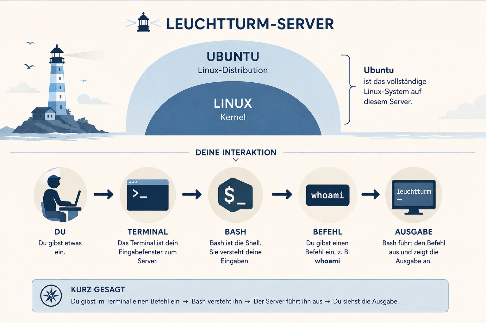

# Schritt 1: Was läuft hier eigentlich?

Im Leuchtturm steht ein Server. Damit du weißt, womit du arbeitest, brauchst
du sechs Begriffe. Du musst sie noch nicht auswendig lernen.



## Vom System bis zum Befehl

- **Linux** ist der technische Kern des Systems. Dieser Kern wird auch
  **Kernel** genannt.
- Eine **Distribution** ergänzt Linux um Programme und Werkzeuge. So entsteht
  ein benutzbares Betriebssystem.
- **Ubuntu** ist eine solche Linux-Distribution. Ubuntu läuft in diesem Lab.
- Das **Terminal** ist der Bereich, in dem du Befehle eingibst und Antworten
  liest.
- Eine **Shell** ist das Programm, das deine Befehle entgegennimmt und
  verarbeitet.
- **Bash** ist eine weitverbreitete Shell. Mit ihr arbeitest du hier.

So hängen die Begriffe zusammen:

```text
Ubuntu-System mit Linux
        ↓
Terminal → Bash → dein Befehl
```

Für den Anfang reicht dieses Bild: **Ubuntu läuft auf dem Server. Im Terminal
gibst du einen Befehl ein. Bash verarbeitet ihn.**

Viele Befehle, die du hier lernst, funktionieren auch in anderen
Linux-Distributionen.

## Kurzer Selbstcheck

Was ist hier das sichtbare Eingabefeld: Linux, Ubuntu, das Terminal oder Bash?

<details>
<summary>Antwort anzeigen</summary>

Das **Terminal** ist der sichtbare Bereich. Darin nimmt die Shell Bash deine
Befehle entgegen.

</details>
