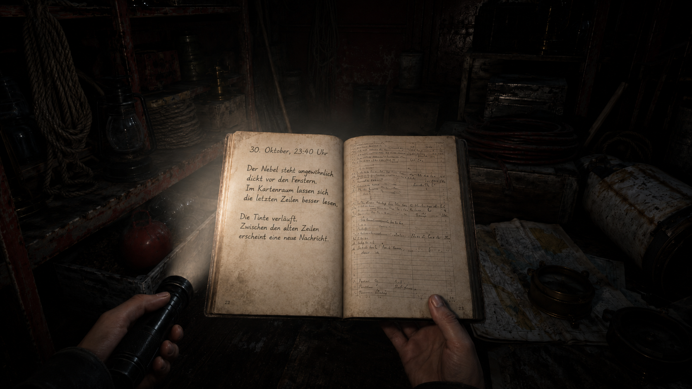

# Dateien, Ordner und die erste Spur

Im Archiv des Lagerraums hast du `letzter_eintrag.txt` gefunden. Draußen
drückt der Nebel gegen die Scheiben; im Leuchtturm bleibt es still. Das
Logbuch ist geschlossen, doch sein letzter Eintrag verweist auf den
Kartenraum.



Du arbeitest weiterhin als `waerter` am Rechner `leuchtturm`. Zu Beginn
befindest du dich direkt im Archiv:

```text
/home/waerter/leuchtturm/untergeschoss/lagerraum/archiv
```

In diesem Workshop lernst du:

- mit `mkdir` ein Verzeichnis zu erstellen;
- mit `echo` und `>` Text in eine Datei zu schreiben;
- mit `cat` kleine Textdateien zu lesen;
- mit `mv` Dateien umzubenennen oder zu verschieben;
- Quelle und Ziel einer Dateioperation zu unterscheiden.

Bekannt sind bereits `pwd`, `ls`, `cd` und `echo`. Neu sind nur `mkdir`,
`>`, `cat` und `mv`. Fehlermeldungen bleiben normale Rückmeldungen des
Systems: Prüfe dann ruhig Standort, Schreibweise und vorhandene Namen.

Am Ende bringst du das Logbuch in den Kartenraum und sicherst die erste Spur.
