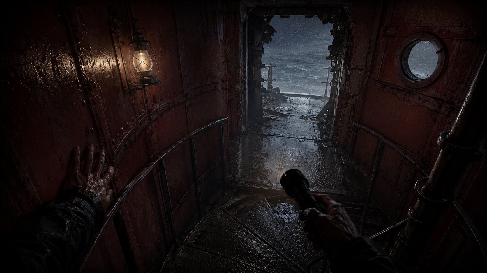

# Das Loch in der Wand

Der Staub legt sich langsam. Dort, wo eben noch Trümmer, morsche Bretter und
alte Kisten lagen, ist nun ein schmales Loch in der Wand zu erkennen. Der
Bereich ist nicht durch einen Befehl verschwunden: Du hast den bereits
eingestürzten, unbrauchbaren Teil kontrolliert geräumt und damit den zuvor
verdeckten Wandabschnitt freigelegt.

Zwischen den Steinen steckt eine kleine, salzfleckige Notiz:

`FLAG{der_waerter_war_hier}`

Die Flagge erscheint erst auf dieser Abschlussseite nach erfolgreichem CHECK
und ist nicht Teil der Linux-Prüfung.

## Rufe das Wichtigste ab

1. Worin unterscheiden sich `cp` und `mv`?
2. Warum schützt `rmdir` ein nicht leeres Verzeichnis?
3. Welche Objekte umfasst `rm -r eingestuerzte-ecke`?
4. Was bewirkt `-f`, und warum ist es keine normale Fehlerbehebung?
5. Welche fünf Fragen stellst du vor einem fremden Terminalbefehl?

Aus dem dunklen Hohlraum dringt ein gleichmäßiges Ticken. Irgendwo im
Leuchtturm arbeitet noch etwas im Hintergrund. Später musst du herausfinden,
welcher Prozess oder Dienst dort weiterläuft.
