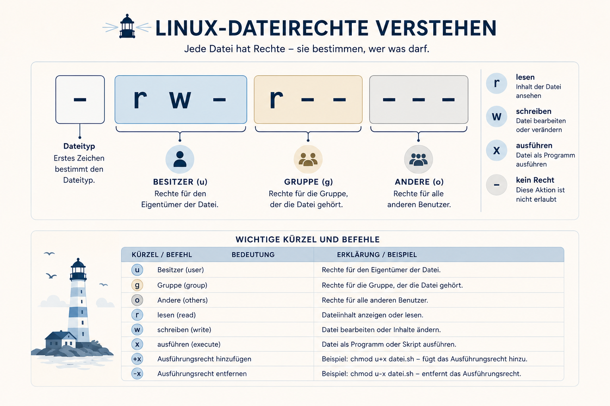

# Rechte an der Schalttafel lesen

Kontrolliere zuerst Identität und Standort:

```bash
whoami
pwd
ls -l
```

In der Ausgabe stehen unter anderem Rechteblock, Besitzername, Gruppenname und
Dateiname. Vergleiche `signaltest` und `uebergabe-chat.log`.



| Kürzel | Bedeutung |
|---|---|
| `u` | Besitzer der Datei |
| `g` | Gruppe der Datei |
| `o` | alle anderen Benutzer |
| `r` | lesen |
| `w` | schreiben |
| `x` | ausführen |
| `+x` | Ausführungsrecht hinzufügen |
| `-x` | Ausführungsrecht entfernen |

| Namensspalte in `ls -l` | Aussage |
|---|---|
| erster Name | Besitzer |
| zweiter Name | Gruppe |

Bei `-rw-r-----` ist das erste `-` der Dateityp. Danach folgen je drei
Zeichen für Besitzer, Gruppe und andere. Ein `-` innerhalb dieser Blöcke
bedeutet: Dieses Recht fehlt.

Welche Datei gehört dir? Welche gehört `nachtwache`?
