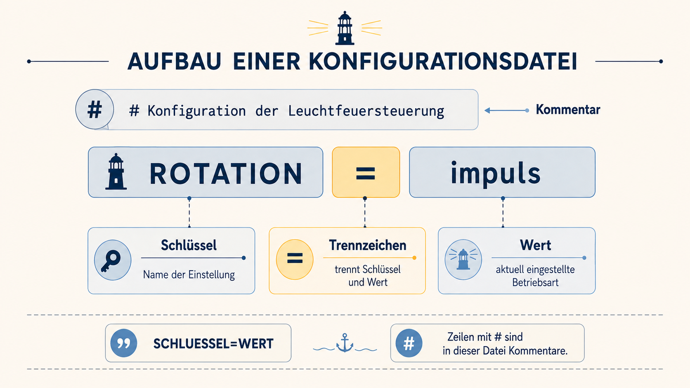

# Welche Einstellungen versteht das Leuchtfeuer?

Das Betriebsprotokoll verweist auf eine Wartungsanleitung. Im kleinen Archiv
der Lichtsteuerung liegen technische Hinweise zu den zulässigen
Betriebsarten.

Eine **Dokumentation** erklärt, welche Einstellungen möglich sind. Eine
**Konfiguration** hält dagegen fest, welche Einstellungen aktuell eingetragen
sind.

## Das Format der Konfiguration

Betrachte eine Zeile aus der aktuellen Datei:

```ini
ROTATION=impuls
```

```text
ROTATION  → Schlüssel
=         → trennt Schlüssel und Wert
impuls    → aktueller Wert
```

Der Schlüssel bezeichnet die Einstellung. Der Wert legt fest, wie diese
Einstellung momentan gesetzt ist.

In der Datei steht außerdem:

```ini
# Konfiguration der Leuchtfeuersteuerung
```

Eine Zeile, die **in dieser Datei** mit `#` beginnt, ist ein Kommentar für
Menschen. Die Lichtsteuerung wendet diese Zeile nicht als Einstellung an.



## Auftrag

Finde die Wartungsanleitung und lies sie.

Kehre anschließend zur aktuellen Konfiguration zurück und vergleiche beide
Dateien. Ermittle:

- welcher Wert einen gleichmäßigen Rundlauf erzeugt,
- welche beiden Einstellungen derzeit unverändert bleiben können,
- welche Zeile in der Konfiguration nur ein Kommentar ist.

<details>
<summary>Hinweis 1 – Dokumentation finden</summary>

Du befindest dich noch im Verzeichnis `protokolle`. Wechsle zunächst eine
Ebene zurück und suche dort das Verzeichnis `dokumentation`.

</details>

<details>
<summary>Hinweis 2 – Bewegung des Lichtstrahls</summary>

Betrachte in der Wartungsanleitung besonders den Abschnitt `ROTATION` und
vergleiche seine Beschreibungen mit dem beobachteten Signal.

</details>

<details>
<summary>Vollständiger Weg</summary>

```bash
cd ..
cd dokumentation
cat wartungsanleitung.txt
cd ..
cat leuchtfeuer.conf
```

</details>

## Erkenntnis

Die Wartungsanleitung beschreibt `kreis` als gleichmäßige Bewegung um den
Turm.

Geschwindigkeit und Bereich sind für die erste Reparatur bereits zulässig.
Die Änderung erfolgt noch nicht.

## Ausblick

Bevor du die Datei bearbeitest, brauchst du einen sicheren Rückweg zum
bisherigen Zustand.
