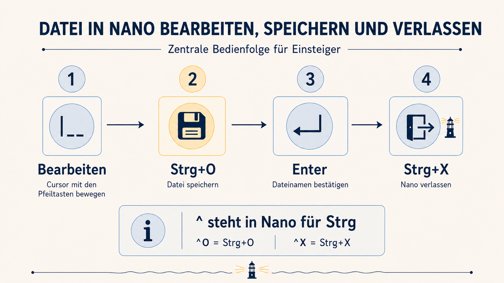

# Wie bedienst du Nano?

Nano ist ein Texteditor, der direkt im Terminal läuft. Im Gegensatz zu `cat`
zeigt Nano eine Datei nicht nur an – du kannst ihren Inhalt bearbeiten.

In diesem ersten Versuch veränderst du noch nichts. Du lernst nur die
Oberfläche und die wichtigsten Tasten kennen.

## Nano öffnen

Öffne die Konfigurationsdatei:

`nano leuchtfeuer.conf`{{exec}}

Nano füllt nun das Terminal aus. Der Dateiinhalt steht im oberen Bereich. Am
unteren Rand zeigt Nano kurze Hinweise auf verfügbare Aktionen, unter anderem:

```text
^O Write Out
^X Exit
```

Das Zeichen `^` steht in Nano für die **Strg-Taste**:

- `^O` bedeutet `Strg+O`,
- `^X` bedeutet `Strg+X`.

## Die wichtigsten Tasten

| Aktion | Bedienung |
|---|---|
| Cursor bewegen | Pfeiltasten |
| Speichern | `Strg+O` |
| Dateinamen bestätigen | `Enter` |
| Nano verlassen | `Strg+X` |



## Gefahrlose Übung

1. Bewege den Cursor mit den Pfeiltasten durch die vorhandenen Zeilen.
2. Verändere noch keinen Text.
3. Verlasse Nano anschließend mit `Strg+X`.

> Falls du versehentlich etwas geändert hast und Nano beim Verlassen nach dem
> Speichern fragt, wähle `N`. Dadurch wird diese unbeabsichtigte Änderung
> nicht gespeichert.

<details>
<summary>Was sehe ich unten im Editor?</summary>

`^O Write Out` bezeichnet das Speichern mit `Strg+O`. `^X Exit` bezeichnet
das Verlassen mit `Strg+X`.

</details>

<details>
<summary>Nano ohne Änderung verlassen</summary>

Drücke `Strg+X`. Wenn du nichts verändert hast, kehrst du direkt zum Prompt
zurück.

</details>

## Abschluss

Du kennst jetzt die Oberfläche und die wichtigsten Tasten. Im nächsten
Schritt änderst du gezielt genau einen Wert.
