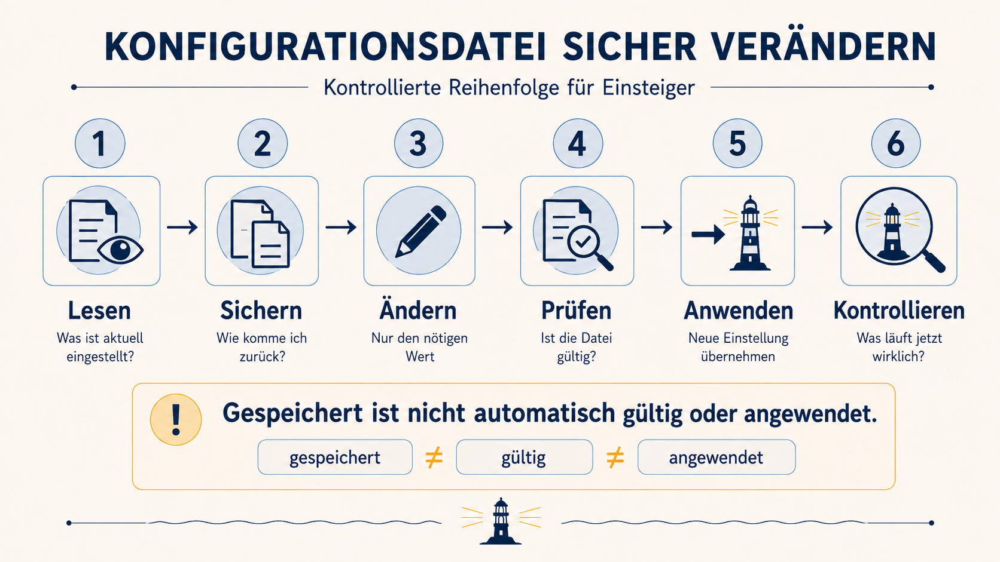

# Wie übernimmt das Leuchtfeuer die neue Einstellung?

Die Datei ist gespeichert und gültig. Die Lichtsteuerung kann trotzdem noch
mit der zuvor geladenen Einstellung arbeiten.

Deshalb übernimmst du die neue Konfiguration bewusst und kontrollierst danach
den Laufzeitstatus.



## Konfiguration anwenden

Führe den vorbereiteten Befehl aus:

`./leuchtfeuer-neu-laden`{{exec}}

Das Werkzeug prüft die Datei erneut und übernimmt anschließend die gültigen
Werte. Bei einer ungültigen Konfiguration wird der bisherige Laufzeitstatus
nicht ersetzt.

## Laufzeitstatus kontrollieren

Zeige danach den tatsächlich angewendeten Zustand an:

`./leuchtfeuer-status`{{exec}}

Erwartet wird:

```text
LEUCHTFEUER=aktiv
ROTATION=kreis
GESCHWINDIGKEIT=langsam
BEREICH=meer
```

Über dir setzt sich die Mechanik gleichmäßig in Bewegung. Der Lichtstrahl
fährt nun ruhig über das Meer und kehrt in einem regelmäßigen Rundlauf zurück.

## Denkfrage

Woran erkennst du den Unterschied zwischen der bearbeiteten Datei und dem
tatsächlich angewendeten Zustand?

<details>
<summary>Hinweis 1 – Änderung übernehmen</summary>

Die geprüfte Konfiguration übernimmst du mit:

```bash
./leuchtfeuer-neu-laden
```

</details>

<details>
<summary>Hinweis 2 – Laufzeitstatus</summary>

Den angewendeten Zustand zeigt dieses vorbereitete Werkzeug:

```bash
./leuchtfeuer-status
```

</details>

<details>
<summary>Vollständiger Ablauf</summary>

```bash
./konfiguration-pruefen
./leuchtfeuer-neu-laden
./leuchtfeuer-status
```

</details>

## Abschluss

Der normale Rundlauf funktioniert wieder. Das Schiff ist vorerst sicher.

Vom Wärter fehlt jedoch weiterhin jede Spur. Die Wartungsanleitung beschreibt
noch einen zweiten Lichtbereich.
