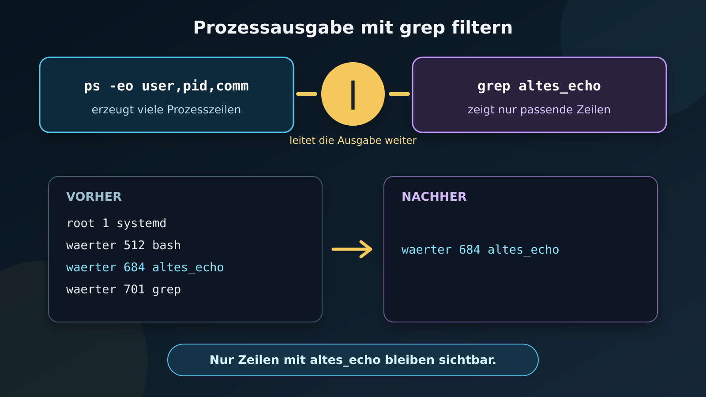

# Welcher Vorgang erzeugt die Erinnerung?

Die entfernte Datei ist zurückgekehrt. Lies sie noch einmal vollständig:

```bash
cat erinnerungen/ERINNERUNG_KEHRT_ZURUECK.txt
```

Die letzte Zeile nennt ihre Herkunft:

```text
Erstellt durch: altes_echo
```

Eine Datei kann sich nicht selbst neu erzeugen. Suche deshalb jetzt nach dem
laufenden Vorgang mit diesem Namen.

## Prozessliste mit `grep` filtern

Verwende diesen Pflichtweg:

```bash
ps -eo user,pid,comm | grep altes_echo
```

`grep` zeigt nur Zeilen, die einen bestimmten Suchtext enthalten.
`|` leitet die Ausgabe des linken Befehls an den rechten Befehl weiter.



## Prozessidentität prüfen

Die gefilterte Ausgabe zeigt den gesuchten Vorgang, zum Beispiel:

```text
waerter  1842 altes_echo
```

Entscheidend ist die Spalte `COMMAND`. Verwende ausschließlich eine Zeile mit
`COMMAND` gleich `altes_echo`.

Prüfe vor dem Beenden alle drei Angaben:

- `USER` ist `waerter`;
- `PID` ist eine eindeutige Zahl;
- `COMMAND` ist exakt `altes_echo`.

## Prozess kontrolliert beenden

Setze die tatsächlich geprüfte PID in den bekannten Befehl ein:

```text
kill PID
```

`PID` ist ein Platzhalter. Gib die beobachtete Zahl ohne das Wort `PID` und
ohne zusätzliche Zeichen ein.

Kontrolliere danach erneut:

```bash
ps -eo user,pid,comm | grep altes_echo
```

Alternativ kannst du den bereits bekannten, namensbezogenen Kontrollbefehl
verwenden:

```bash
pgrep -a altes_echo
```

Nur eine Zeile, deren Prozessname tatsächlich `altes_echo` ist, weist auf den
erzeugenden Vorgang hin. Bleibt die gefilterte Ausgabe leer, wurde kein
passender Prozess gefunden.

## Erinnerung endgültig entfernen

Wenn die Kontrolle keinen laufenden Prozess `altes_echo` mehr zeigt, entferne
die zurückgebliebene Datei:

```bash
rm erinnerungen/ERINNERUNG_KEHRT_ZURUECK.txt
```

Warte einen kurzen Moment und kontrolliere `erinnerungen` erneut. Die Datei
soll jetzt fortbleiben. Starte anschließend die Stabilisierung erneut, um den
nächsten Zustand zu prüfen.

<details>
<summary>Hinweis 1 – Prozessname finden</summary>

Lies die wiederkehrende Datei bis zur letzten Zeile. Der Text hinter
`Erstellt durch:` ist der Suchbegriff für die Prozessliste.

</details>

<details>
<summary>Hinweis 2 – Pipe verstehen</summary>

Ordne in der Grafik den linken Befehl, die Pipe in der Mitte und den rechten
Filter ihrer jeweiligen Beschriftung zu.

</details>

<details>
<summary>Hinweis 3 – richtige PID auswählen</summary>

Vergleiche nicht nur die Zahl. Verwende ausschließlich die Zeile, in der
gleichzeitig `USER` gleich `waerter` und `COMMAND` gleich `altes_echo` ist.

</details>

<details>
<summary>Hinweis 4 – vollständiger Ablauf</summary>

Ersetze `<GEPRÜFTE_PID>` durch die Zahl aus der eindeutig passenden Zeile.
Die spitzen Klammern werden nicht eingegeben.

```bash
cat erinnerungen/ERINNERUNG_KEHRT_ZURUECK.txt
ps -eo user,pid,comm | grep altes_echo
kill <GEPRÜFTE_PID>
ps -eo user,pid,comm | grep altes_echo
pgrep -a altes_echo
rm erinnerungen/ERINNERUNG_KEHRT_ZURUECK.txt
ls erinnerungen
./leuchtturm-stabilisieren
```

Wenn der erste Kontrollbefehl keine Zeile mehr zeigt und `pgrep` keine
passende Instanz findet, ist der erzeugende Vorgang beendet.

</details>

## Erkenntnis

Das Löschen einer erzeugten Datei beseitigt nicht ihre Ursache. Erst nachdem
der eindeutig geprüfte Prozess beendet wurde, bleibt die anschließend
entfernte Datei verschwunden.
